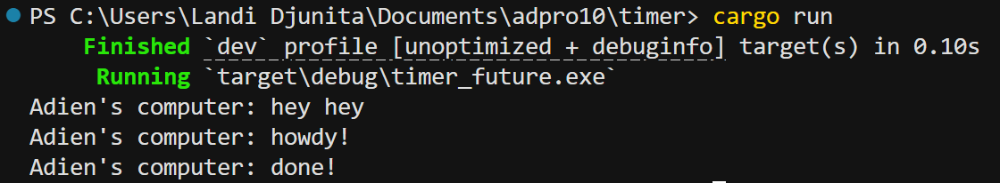

## 1. 

After spawning the async task and printing “hey hey” immediately, the executor’s run method begins servicing the queued future. It starts by driving the future just far enough to print “howdy!”, then it pauses at the .await. This is because  the TimerFuture isn’t ready yet (it returns Poll::Pending). Once done, it stores the task’s waker so it can be awakened once the timer complete. A background threat will wait the delay out, then flips the completion flag, and triggers the waker. Therefore, when the executor polls again, it sees the timer’s done and prints “done!”, printing the sequence “hey hey”, “howdy!”, “done!”.