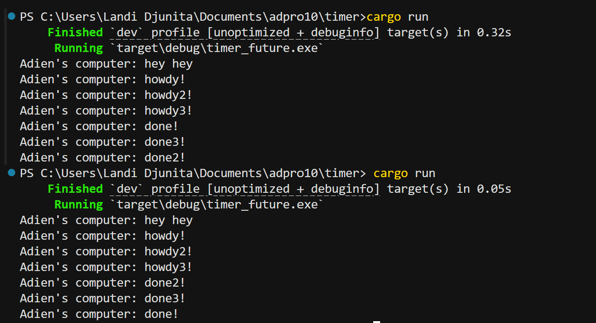
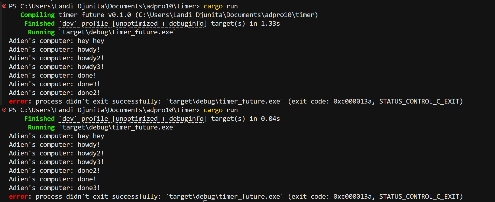

## Add Print After Spawn 

After spawning the async task and printing “hey hey” immediately, the executor’s run method begins servicing the queued future. It starts by driving the future just far enough to print “howdy!”, then it pauses at the .await. This is because  the TimerFuture isn’t ready yet (it returns Poll::Pending). Once done, it stores the task’s waker so it can be awakened once the timer complete. A background threat will wait the delay out, then flips the completion flag, and triggers the waker. Therefore, when the executor polls again, it sees the timer’s done and prints “done!”, printing the sequence “hey hey”, “howdy!”, “done!”.

## Replicate Spawn 

Dropping the 'Spawner' lets the executor know no new tasks will come. Therefore, after it polls each async job once (printing “howdy!”, “howdy2!”, “howdy3!”) and they all suspend on their two-second timers, the executor waits for each timer’s background thread to wake its task and re-enqueue it. This is because those wake-ups happen nearly simultaneously. The final “done!”, “done2!”, and “done3!” prints race in whatever order the executor happens to dequeue them. Once all three complete and the queue is empty, 'executor.run()' returns.

## Remove drop(spawner);

Since the final 'Spawner' isn’t dropped, its sender stays indefinitely active. Once the three tasks finish, 'executor.run()' calls for recv()' again and hangs, expecting tasks that will never come. This causes the program to never terminate by itself. Breaking out the infinite wait is done by pressing Ctrl+C Dropping the spawner closes the channel, makes 'recv()' return an error, and allows 'run()' to return normally.
